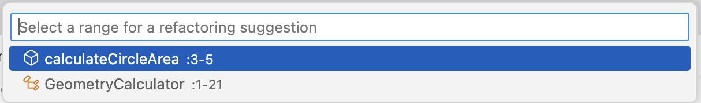
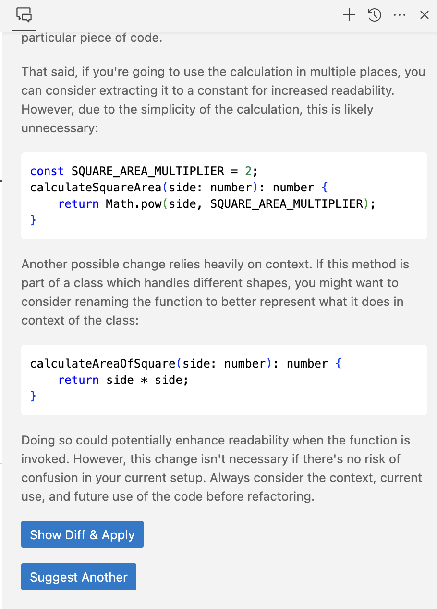
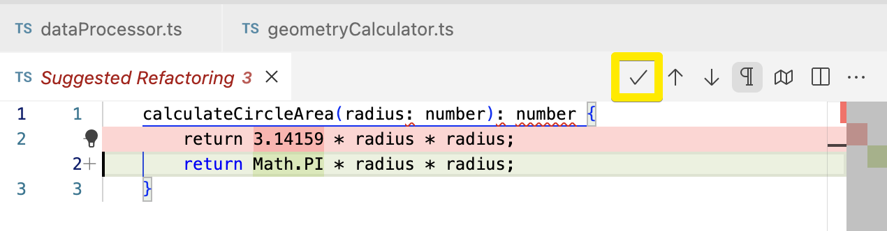

# Refactoring Participant

A Co-Pilot extension that contributes a refactoring support. 

### Menu
It contributes a 'Suggest Refactoring' command that makes refactoring suggestions for the current selection.

When there is no selection in the editor a quick pick dialog allows to select a range to be refactored.

### Response
The suggestions appears in the Chat view with buttons to: 
- preview and apply the suggestions.
- request another suggestion.

The changes can be previewed in a diff editor which provides a command to apply the changes.

### Chat Commands
In addition, the extension contributes a several '/' commands to the Chat view which can request for specific refactoring suggestions.

