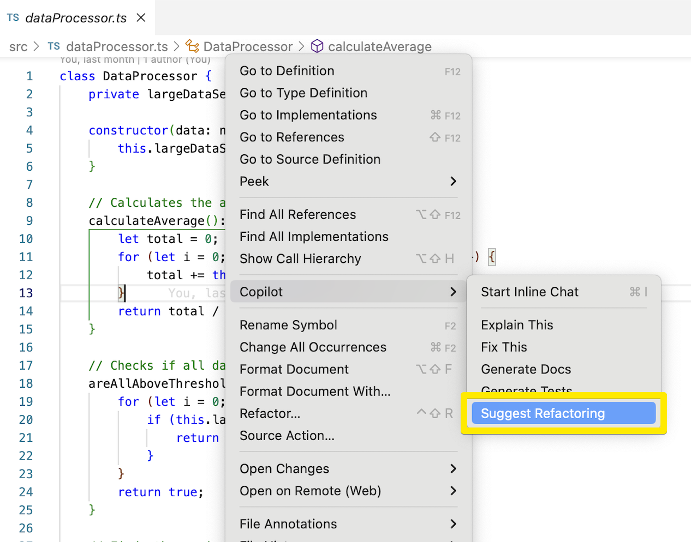
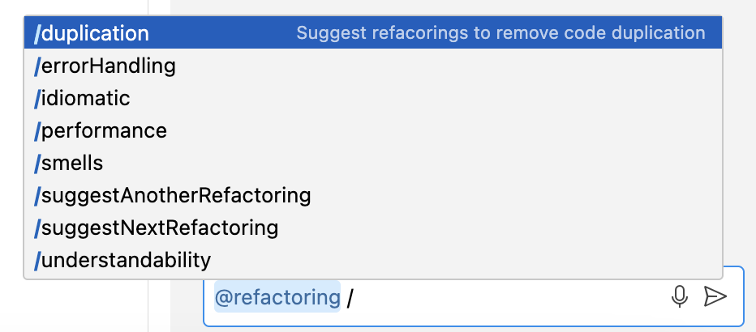

# Refactoring Participant

A Co-Pilot extension that contributes a refactoring support. It contributes a 'Suggest Refactoring' command that makes refactoring suggestions for the current selection.

The suggestions appears in the Chat view. The view provides commands to preview and apply the suggestions.

In addition, the extension contributes a several '/' commands to the Chat view which can request for specific suggestions.

